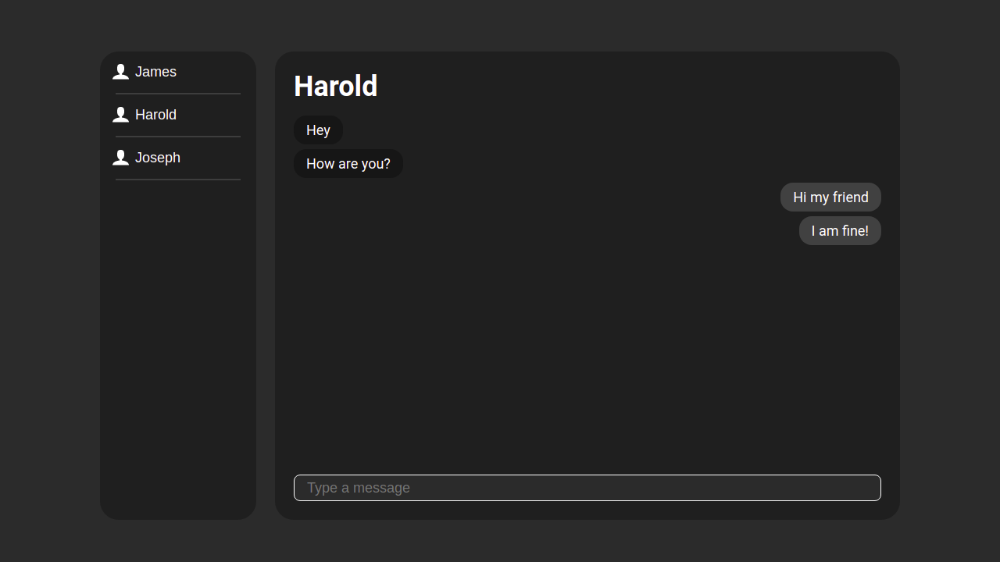

# Chat.io

## Summary
Chat.io is a real-time messaging app. It is possible to create new users just by their nickname. All messages are saved on the server, so the user can retrieve all conversations whenever he logs in. Try the app at: https://lhmoreno-chat-io.herokuapp.com/

## Preview


## Tools
- [x] [Node.js](https://nodejs.org/)
- [x] [Express](http://expressjs.com/)
- [x] [Socket.io](https://socket.io/)

## Building
1. Make sure node is installed on your computer. If not [click here](https://nodejs.org/).
2. Clone this repository:
```shell
git clone https://github.com/lhmoreno/chat.io.git
```
3. Access the `chat.io` folder:
```shell
cd chat.io
```
4. Install all dependencies:
```shell
npm install
```
5. Start the project in development mode:
```shell
npm run dev
```
